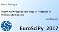
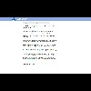
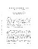

.. include:: ../README.rst
       
.. sidebar:: External Ressources

    :Papers:
             * |arXiv2017|

    :Conferences:
                  * |EuroScipy2017b|
                  * |EuroScipy2017a|
                  * |jdS2016|

                   

                   
.. |jdS2016| image:: https://thumb.ccsd.cnrs.fr/8091494/thumb/little
             :target: https://hal.inria.fr/hal-01316276/file/submission_167.pdf
             
Installation
============

.. toctree::
    :maxdepth: 2

    install/anaconda
    install/source

Documentation
=============

.. toctree::
    :maxdepth: 2

    user_guide
    examples/index
    faq/index
    
Tutorials
=========

.. toctree::
    :maxepth: 1

    A <http://raw.githubusercontent.com/StatisKit/FP17/master/>

Authors
=======

.. include:: ../AUTHORS.rst
