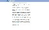

.. include:: ../README.rst

.. Copyright [2017-2018] UMR MISTEA INRA, UMR LEPSE INRA,                ..
..                       UMR AGAP CIRAD, EPI Virtual Plants Inria        ..
.. Copyright [2015-2016] UMR AGAP CIRAD, EPI Virtual Plants Inria        ..
..                                                                       ..
.. This file is part of the AutoWIG project. More information can be     ..
.. found at                                                              ..
..                                                                       ..
..     http://autowig.rtfd.io                                            ..
..                                                                       ..
.. The Apache Software Foundation (ASF) licenses this file to you under  ..
.. the Apache License, Version 2.0 (the "License"); you may not use this ..
.. file except in compliance with the License.You should have received a ..
.. copy of the Apache License, Version 2.0 along with this file; see the ..
.. file LICENSE. If not, you may obtain a copy of the License at         ..
..                                                                       ..
..     http://www.apache.org/licenses/LICENSE-2.0                        ..
..                                                                       ..
.. Unless required by applicable law or agreed to in writing, software   ..
.. distributed under the License is distributed on an "AS IS" BASIS,     ..
.. WITHOUT WARRANTIES OR CONDITIONS OF ANY KIND, either express or       ..
.. mplied. See the License for the specific language governing           ..
.. permissions and limitations under the License.                        ..

.. sidebar:: External Ressources

            .. raw:: html

               

            .. raw:: html

               

            .. raw:: html

               
        
..   :Papers:
..             * |arXiv2017|
..
..    :Conferences:
..                  * |EuroScipy2017b|
..                  * |EuroScipy2017a|
..                  * |jdS2016|
..
.. .. |EuroScipy2017b| image:: thumbnails/EuroSciPy2017b.jpg
..                   :target: https://www.youtube.com/watch?v=N4q_Vud77Hw
..                  

..                   :target: https://www.euroscipy.org/2017/descriptions/19828.html
..
.. .. |arXiv2017| image:: thumbnails/arXiv2017.jpg
..               :target: https://arxiv.org/pdf/1705.11000
..                   
.. .. |jdS2016| image:: https://thumb.ccsd.cnrs.fr/8091494/thumb/little
..             :target: https://hal.inria.fr/hal-01316276/file/submission_167.pdf
             
Installation
============

.. toctree::
    :maxdepth: 2

    install/anaconda
    install/source

Documentation
=============

.. toctree::
    :maxdepth: 2

    user_guide
    examples/index
    faq/index
    
Tutorials
=========

.. toctree::
    :maxepth: 1

    A <http://raw.githubusercontent.com/StatisKit/FP17/master/>

Authors
=======

.. include:: ../AUTHORS.rst
